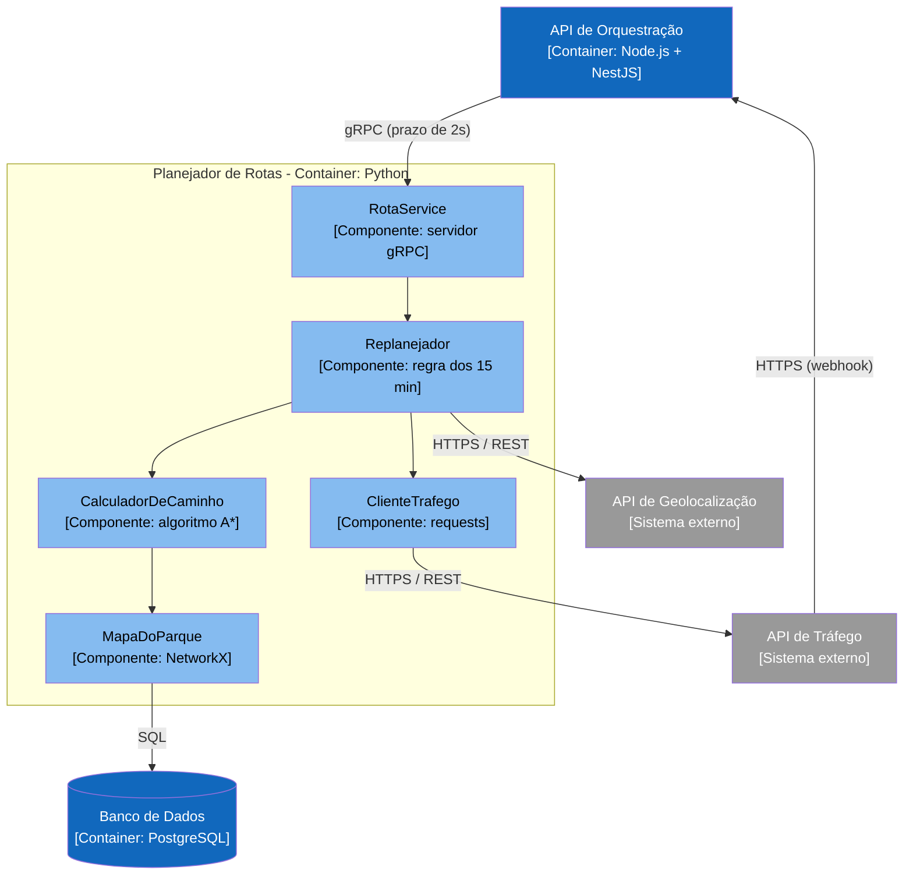

# C4 Nível 3 - Componentes do Planejador de Rotas

```mermaid
flowchart TB
    api["API de Orquestração<br/>[Container: Node.js + NestJS]"]

    subgraph planejador[Planejador de Rotas - Container: Python]
        grpc["RotaService<br/>[Componente: servidor gRPC]"]
        replan["Replanejador<br/>[Componente: regra dos 15 min]"]
        grafo["MapaDoParque<br/>[Componente: NetworkX]"]
        astar["CalculadorDeCaminho<br/>[Componente: algoritmo A*]"]
        trafego["ClienteTrafego<br/>[Componente: requests]"]
    end

    bd[("Banco de Dados<br/>[Container: PostgreSQL]")]
    apiTrafego["API de Tráfego<br/>[Sistema externo]"]
    geo["API de Geolocalização<br/>[Sistema externo]"]

    apiTrafego -->|"HTTPS (webhook)"| api
    api -->|"gRPC (prazo de 2s)"| grpc
    grpc --> replan
    replan --> trafego
    replan --> astar
    astar --> grafo
    grafo -->|SQL| bd
    trafego -->|"HTTPS / REST"| apiTrafego
    replan -->|"HTTPS / REST"| geo

    classDef container fill:#1168bd,color:#fff
    classDef comp fill:#85bbf0,color:#000
    classDef ext fill:#999,color:#fff
    class api,bd container
    class grpc,replan,grafo,astar,trafego comp
    class apiTrafego,geo ext
```
