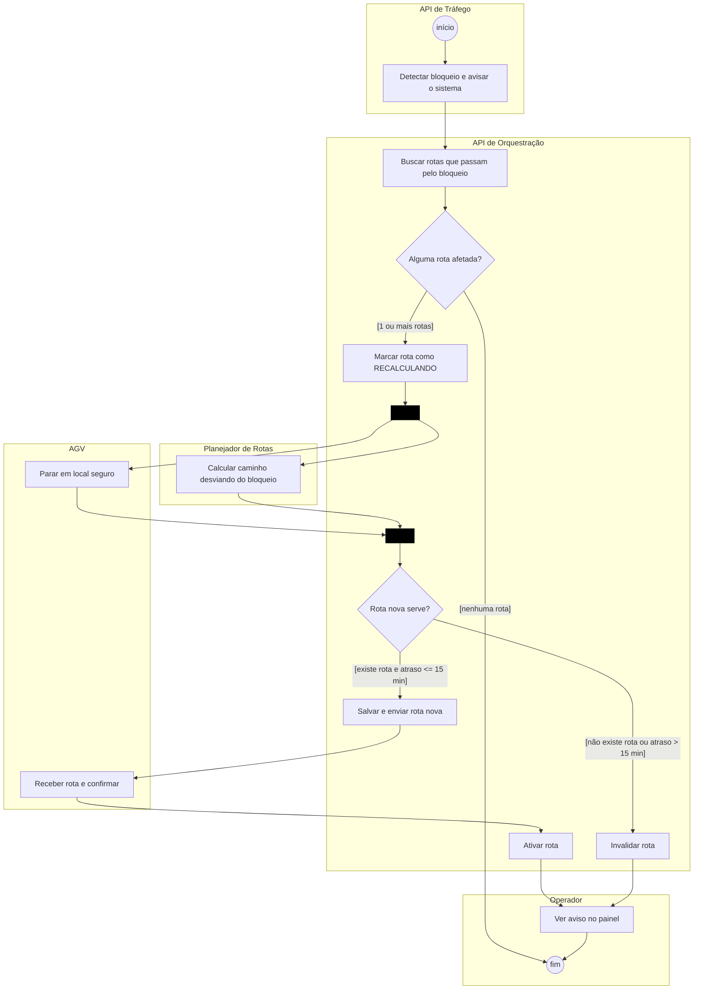

# Diagrama de Atividades - Replanejamento de Rota

```mermaid
flowchart TB
    subgraph R1[API de Tráfego]
        I((início))
        T1[Detectar bloqueio e avisar o sistema]
    end

    subgraph R2[API de Orquestração]
        B1[Buscar rotas que passam pelo bloqueio]
        D0{Alguma rota afetada?}
        B2[Marcar rota como RECALCULANDO]
        FORK[ ]:::barra
        JOIN[ ]:::barra
        D1{Rota nova serve?}
        B3[Salvar e enviar rota nova]
        B4[Ativar rota]
        B5[Invalidar rota]
    end

    subgraph R3[Planejador de Rotas]
        C1[Calcular caminho desviando do bloqueio]
    end

    subgraph R4[AGV]
        G1[Parar em local seguro]
        G2[Receber rota e confirmar]
    end

    subgraph R5[Operador]
        E1[Ver aviso no painel]
        F((fim))
    end

    I --> T1 --> B1 --> D0
    D0 -->|"[nenhuma rota]"| F
    D0 -->|"[1 ou mais rotas]"| B2 --> FORK
    FORK --> G1 --> JOIN
    FORK --> C1 --> JOIN
    JOIN --> D1
    D1 -->|"[existe rota e atraso <= 15 min]"| B3 --> G2 --> B4 --> E1
    D1 -->|"[não existe rota ou atraso > 15 min]"| B5 --> E1
    E1 --> F

    classDef barra fill:#000,stroke:#000,color:#000
```
