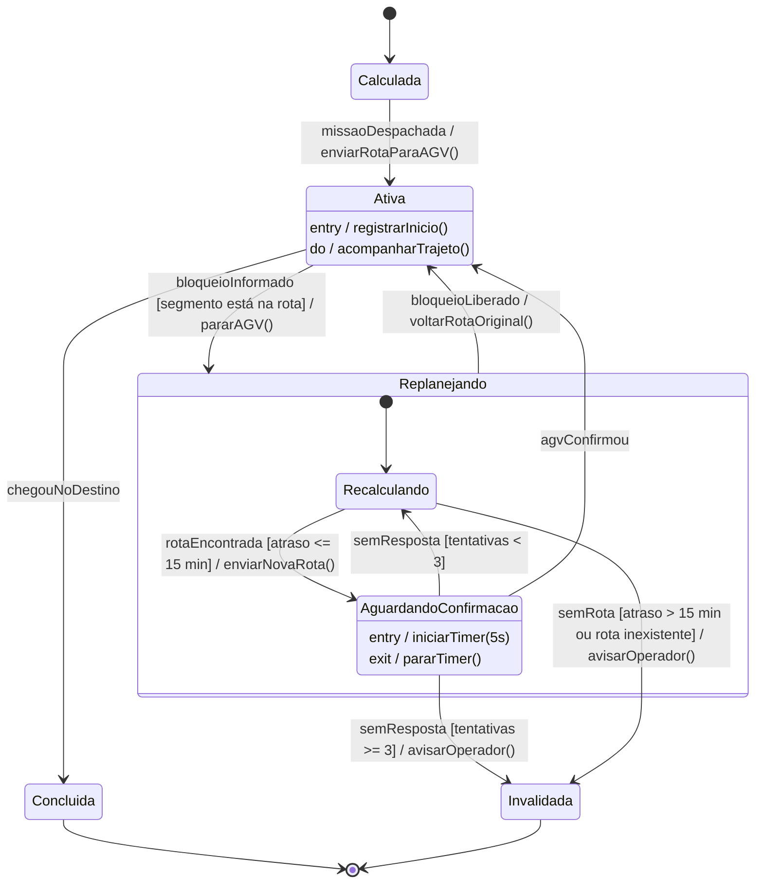

# Diagrama de Estados - Rota

```mermaid
stateDiagram-v2
    [*] --> Calculada
    Calculada --> Ativa : missaoDespachada / enviarRotaParaAGV()

    state "Ativa" as Ativa
    Ativa : entry / registrarInicio()
    Ativa : do / acompanharTrajeto()

    Ativa --> Concluida : chegouNoDestino
    Ativa --> Replanejando : bloqueioInformado [segmento está na rota] / pararAGV()

    state Replanejando {
        [*] --> Recalculando
        Recalculando --> AguardandoConfirmacao : rotaEncontrada [atraso <= 15 min] / enviarNovaRota()
        AguardandoConfirmacao --> Recalculando : semResposta [tentativas < 3]
    }

    state "AguardandoConfirmacao" as AguardandoConfirmacao
    AguardandoConfirmacao : entry / iniciarTimer(5s)
    AguardandoConfirmacao : exit / pararTimer()

    AguardandoConfirmacao --> Ativa : agvConfirmou
    AguardandoConfirmacao --> Invalidada : semResposta [tentativas >= 3] / avisarOperador()
    Recalculando --> Invalidada : semRota [atraso > 15 min ou rota inexistente] / avisarOperador()
    Replanejando --> Ativa : bloqueioLiberado / voltarRotaOriginal()

    Concluida --> [*]
    Invalidada --> [*]
```
