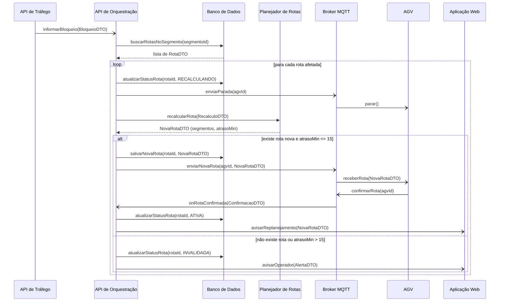

# Diagrama de Sequência - Replanejamento de Rota

```mermaid
sequenceDiagram
    participant Trafego as API de Tráfego
    participant API as API de Orquestração
    participant BD as Banco de Dados
    participant Planejador as Planejador de Rotas
    participant Broker as Broker MQTT
    participant AGV
    participant Web as Aplicação Web

    Trafego-)API: informarBloqueio(BloqueioDTO)
    API->>BD: buscarRotasNoSegmento(segmentoId)
    BD-->>API: lista de RotaDTO

    loop para cada rota afetada
        API->>BD: atualizarStatusRota(rotaId, RECALCULANDO)
        API-)Broker: enviarParada(agvId)
        Broker-)AGV: parar()
        API->>Planejador: recalcularRota(RecalculoDTO)
        Planejador-->>API: NovaRotaDTO (segmentos, atrasoMin)

        alt existe rota nova e atrasoMin <= 15
            API->>BD: salvarNovaRota(rotaId, NovaRotaDTO)
            API-)Broker: enviarNovaRota(agvId, NovaRotaDTO)
            Broker-)AGV: receberRota(NovaRotaDTO)
            AGV-)Broker: confirmarRota(agvId)
            Broker-)API: onRotaConfirmada(ConfirmacaoDTO)
            API->>BD: atualizarStatusRota(rotaId, ATIVA)
            API-)Web: avisarReplanejamento(NovaRotaDTO)
        else não existe rota ou atrasoMin > 15
            API->>BD: atualizarStatusRota(rotaId, INVALIDADA)
            API-)Web: avisarOperador(AlertaDTO)
        end
    end
```
